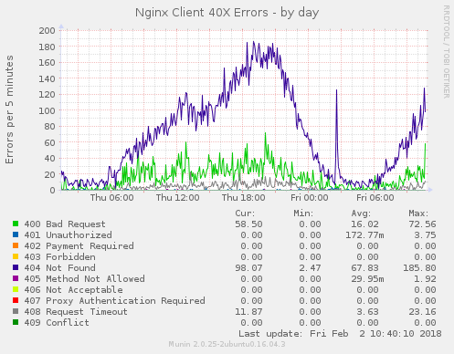
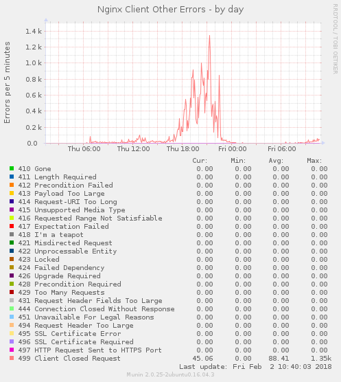
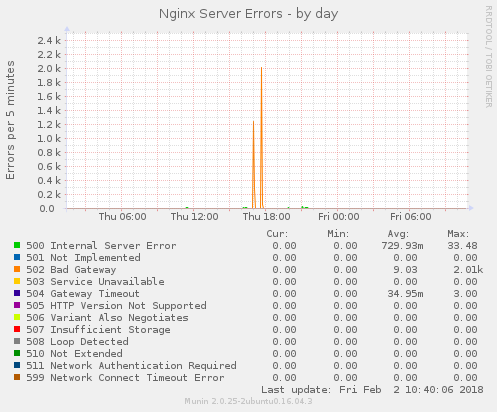

munin-nginx-errors
==================

[Munin](http://munin-monitoring.org/)
[plugin](http://guide.munin-monitoring.org/en/latest/develop/plugins/index.html)
displaying the number of errors in
[Nginx webserver](https://nginx.org/)

Dependencies
------------

To install the plugin you need Python 2.7. It should be already available in
your OS if you use one of the modern GNU/Linux distros. Munin is an obvious
requirement.

Hacking
-------

When the dependency is installed, clone the repository to a directory where
you have a regular user access (e.g. home dir of your sudo user on the server).

Then symbolically link the plugin files as a super user to following places:

(Replace `youruser` and `yourdir` with your own values)

```
ln -s /home/youruser/yourdir/nginx_client_40x_errors.py /etc/munin/plugins/nginx_client_40x_errors
ln -s /home/youruser/yourdir/nginx_client_other_errors.py /etc/munin/plugins/nginx_client_other_errors
ln -s /home/youruser/yourdir/nginx_server_errors.py /etc/munin/plugins/nginx_server_errors
```

Add following lines in your Munin Node config file `/etc/munin/plugin-conf.d/munin-node`:

```
[nginx_client_40x_err]
user root

[nginx_client_other_err]
user root

[nginx_server_err]
user root
```

Restart Munin Node.

Usage
-----

The monitoring results are available in [webserver category](http://munin-monitoring.org/wiki/graph_category_list).

RRDTool should produce graphs like these:







You can tweak monitored response codes as you want, by editing corresponding
`nginx_*_errors.py` files.

Credits
-------

This plugin is based on [nginx-error-rate](https://gist.github.com/eykd/1107061)
code by David Eyk.

License
-------

GNU General Public License version 3 (or later). See COPYING file for more
information.

